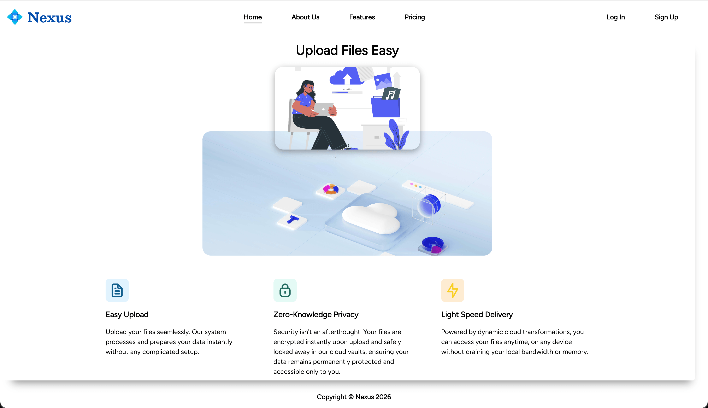
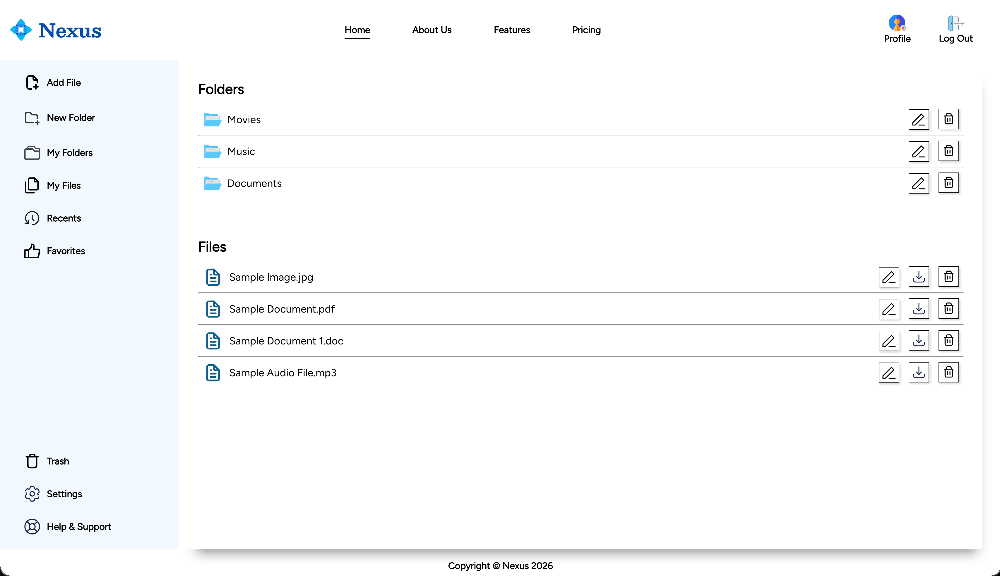
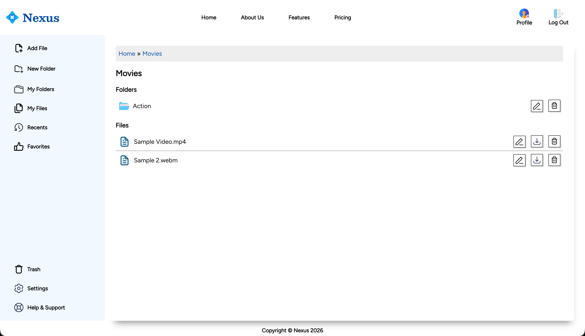
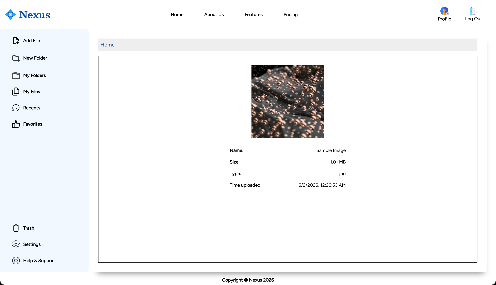

# The Odin Project: File Uploader

This is a solution to the [File Uploader Project](https://www.theodinproject.com/lessons/nodejs-file-uploader) as part of The Odin Project curriculum. 

## Table of contents

- [The Odin Project: File Uploader](#the-odin-project-file-uploader)
  - [Table of contents](#table-of-contents)
  - [Overview](#overview)
    - [Screenshots](#screenshots)
    - [Links](#links)
  - [Credits](#credits)
    - [Icons \& Images](#icons--images)
    - [Fonts](#fonts)
    - [Useful resources](#useful-resources)

## Overview

This project is a simple web app that allows users to upload files and view them. It is built using Node.js, Express, and EJS. 

Users can create folders to the app and add files to them. Nested folders are also supported. Only registered users can upload files and view them. Users have the option to rename and delete their files and folders. They can also download the files. When a user clicks on a file, they are redirected to a new page where they can view the file details.

All data is stored in a PostgreSQL database and files are stored in Cloudinary.

### Screenshots

<table>
  <tr>
    <td align="center">
      
       
      <em>Visitor homepage</em>
    </td>
    <td align="center">
      
       
      <em>User homepage</em>
    </td>
  </tr>
  <tr>
    <td align="center">
      
       
      <em>Sub folder</em>
    </td>
    <td align="center">
      
       
      <em>Image file</em>
    </td>
  </tr>
</table>

### Links

- [Solution URL](https://github.com/py-code314/file-uploader)
- [Live Site URL](https://file-uploader-um68.onrender.com/)

## Credits

### Icons & Images

- All icons are from [SVG Repo](https://www.svgrepo.com/) 
- Illustration is from [Storyset](https://storyset.com/illustration/upload/cuate)
- Image "a computer screen with a cloud shaped object on top of it" by "Hazel Z" is from [Unsplash](https://unsplash.com/photos/a-computer-screen-with-a-cloud-shaped-object-on-top-of-it-FocSgUZ10JM)

### Fonts

- Besley & Figtree fonts are downloaded from [Google Fonts](https://fonts.google.com/)
- All fonts are converted using [transfonter](https://transfonter.org/)

### Useful resources

- Box shadows generator - [getcssscan.com](https://getcssscan.com/css-box-shadow-examples)
- Sample files are downloaded from [SAMPLE FILES](https://getsamplefiles.com/)

